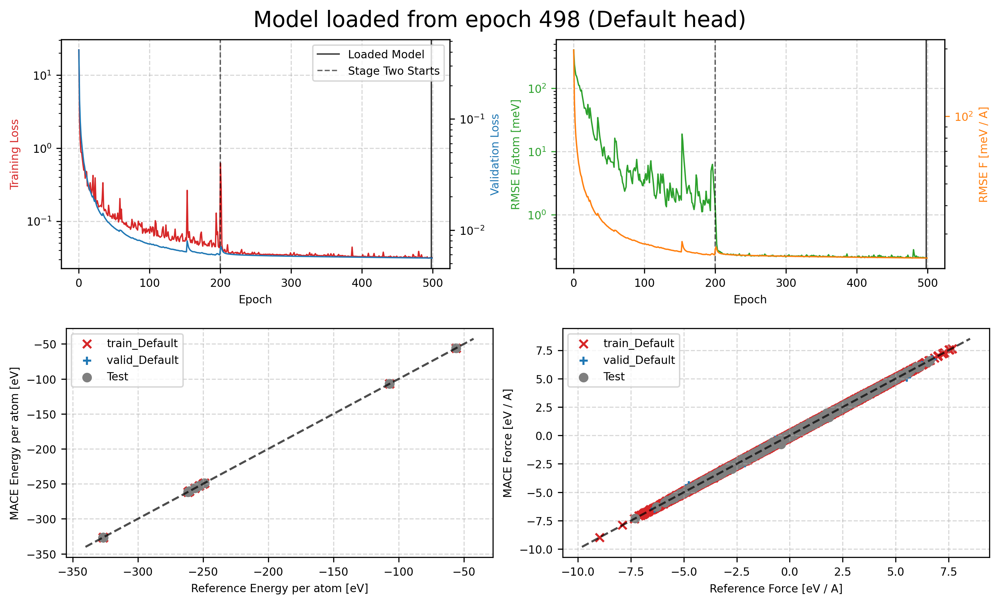

## 利用MACE训练一个SiO2和Si的MLP
1、准备数据集：数据集为**extxyz**格式文件，可以查看**example.xyz**文件作为一个示例(example.xyz是此处部分用于训练的数据)

2、调整**train.py**中的参数后执行
```
python train.py
```
3、一个典型的输出参考 **std.out** 中
4、结果
```
$ ls MACE_models/
mace_model_compiled.model  mace_model_run-42_debug.log         mace_model_run-42.log             mace_model_run-42_train_Default_stage_one.png  mace_model_stagetwo_compiled.model
mace_model_config.yml      mace_model_run-42_epoch-192.pt      mace_model_run-42.model           mace_model_run-42_train_Default_stage_two.png  mace_model_stagetwo.model
mace_model.model           mace_model_run-42_epoch-498_swa.pt  mace_model_run-42_stagetwo.model  mace_model_run-42_train.txt
```

```
 905 2026-06-28 15:30:33.024 INFO: Error-table on TRAIN and VALID:
 906 +---------------+---------------------+------------------+-------------------+
 907 |  config_type  | RMSE E / meV / atom | RMSE F / meV / A | relative F RMSE % |
 908 +---------------+---------------------+------------------+-------------------+
 909 | train_Default |            0.3      |         17.5     |          1.53     |
 910 | valid_Default |            0.2      |         23.4     |          2.03     |
 911 +---------------+---------------------+------------------+-------------------+
```
### MACE
Batatia, I., Kovács, D. P., Simm, G. N. C., Ortner, C. & Csányi, G. MACE: Higher Order Equivariant Message Passing Neural Networks for Fast and Accurate Force Fields. Preprint at https://doi.org/10.48550/arXiv.2206.07697 (2023).
